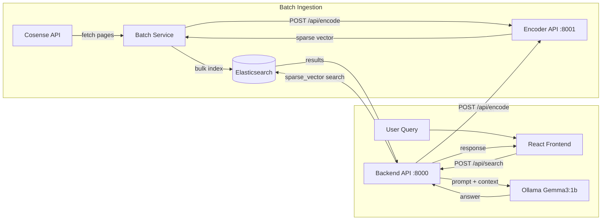

# RAG Application: Cosense + Elasticsearch + SPLADE + Ollama

Cosense のページデータを取得し、japanese-splade でスパースベクトル化して Elasticsearch に格納。ユーザーのクエリに対してスパースベクトル検索を行い、Ollama (Gemma3:1b) で回答を生成する RAG アプリケーション。

## Architecture Overview



## Tech Stack

| Layer | Technology |
|-------|------------|
| Frontend | TypeScript + React (Vite) |
| Backend API | Python + FastAPI (port 8000) |
| Encoder API | Python + FastAPI (port 8001) |
| Batch Ingestion | Python CLI script |
| Sparse Vector | `hotchpotch/japanese-splade-v2` via `yasem` |
| Search Engine | Elasticsearch 8.17.0 (Docker) |
| LLM | Ollama + Gemma3:1b |

---

## Proposed Changes

### Infrastructure (Docker)

#### [NEW] docker-compose.yml

Elasticsearch と Ollama の Docker コンテナを定義。

```yaml
services:
  elasticsearch:
    image: docker.elastic.co/elasticsearch/elasticsearch:8.17.0
    environment:
      - discovery.type=single-node
      - xpack.security.enabled=false
    ports:
      - "9200:9200"
  ollama:
    image: ollama/ollama:latest
    ports:
      - "11434:11434"
    volumes:
      - ollama_data:/root/.ollama
```

---

### Encoder Service (`encoder/`)

Sparse vector 変換を担う独立した API サービス。Backend API と Batch の両方から利用される。

#### [NEW] encoder/pyproject.toml

依存: `fastapi`, `uvicorn`, `yasem`, `pydantic-settings`

#### [NEW] encoder/app/config.py

環境変数:
- `SPLADE_MODEL`: SPLADEモデル名 (default: `hotchpotch/japanese-splade-v2`)

#### [NEW] encoder/app/sparse_encoder.py

`yasem` を使った SPLADE エンコーダー:
- `encode_text(text) -> dict[str, float]` — テキストをスパースベクトルに変換
- モデルはシングルトンでロード

#### [NEW] encoder/app/main.py

FastAPI アプリケーション:
- `POST /api/encode` — テキストを受け取り、スパースベクトルを返す
  - Request: `{ "text": "..." }`
  - Response: `{ "vector": { "token": weight, ... } }`
- `GET /api/health` — ヘルスチェック
- 起動時にモデルをプリロード

---

### Backend API (`backend/`)

検索 API。Encoder API を呼んでクエリをベクトル化し、Elasticsearch で検索、Ollama で回答生成。

#### [NEW] backend/pyproject.toml

依存: `fastapi`, `uvicorn`, `elasticsearch` (8.x), `ollama`, `httpx`, `pydantic-settings`

#### [NEW] backend/app/config.py

環境変数:
- `ELASTICSEARCH_URL` (default: `http://localhost:9200`)
- `ELASTICSEARCH_INDEX` (default: `cosense_pages`)
- `OLLAMA_BASE_URL` (default: `http://localhost:11434`)
- `OLLAMA_MODEL` (default: `gemma3:1b`)
- `ENCODER_URL` (default: `http://localhost:8001`)

#### [NEW] backend/app/encoder_client.py

Encoder API への HTTP クライアント:
- `encode(text) -> dict[str, float]`

#### [NEW] backend/app/es_client.py

Elasticsearch 検索:
- `search(sparse_vector, top_k)` — スパースベクトルで検索

マッピング:
```json
{
  "mappings": {
    "properties": {
      "title": { "type": "text", "analyzer": "kuromoji" },
      "content": { "type": "text", "analyzer": "kuromoji" },
      "content_vector": { "type": "sparse_vector" },
      "source_url": { "type": "keyword" },
      "updated_at": { "type": "date" }
    }
  }
}
```

#### [NEW] backend/app/llm_client.py

Ollama クライアント:
- `generate_answer(query, contexts) -> str` — Gemma3:1b で回答を生成

#### [NEW] backend/app/main.py

FastAPI アプリケーション:
- `POST /api/search` — encode → ES search → LLM 回答生成
  - Request: `{ "query": "...", "top_k": 5 }`
  - Response: `{ "answer": "...", "sources": [...], "query": "..." }`
- `GET /api/health` — ヘルスチェック
- CORS ミドルウェア設定

---

### Batch Ingestion (`batch/`)

Cosense → Elasticsearch のバッチ取り込み。Backend とは独立したプロジェクト。

#### [NEW] batch/pyproject.toml

依存: `elasticsearch` (8.x), `httpx`, `pydantic-settings`

#### [NEW] batch/app/config.py

環境変数:
- `COSENSE_PROJECT` (default: `stacker8`)
- `COSENSE_SID` (optional, プライベートプロジェクト用)
- `ELASTICSEARCH_URL`, `ELASTICSEARCH_INDEX`
- `ENCODER_URL` (default: `http://localhost:8001`)

#### [NEW] batch/app/cosense_client.py

Cosense API クライアント:
- `list_page_titles()` — ページネーション対応でページ一覧を取得
- `get_page_text(title)` — ページ本文を取得
- `fetch_all_pages()` — 全ページ取得

#### [NEW] batch/app/encoder_client.py

Encoder API への HTTP クライアント

#### [NEW] batch/app/es_client.py

Elasticsearch インデックス操作:
- `create_index()` — sparse_vector マッピングでインデックス作成
- `bulk_index(docs)` — バルクインデックス
- `count()` — ドキュメント数

#### [NEW] batch/app/ingest.py

実行: `python -m app.ingest`
1. Encoder サービスのヘルスチェック
2. Cosense からページ一覧を取得
3. 各ページのテキストを取得
4. Encoder API でスパースベクトル化
5. Elasticsearch にバルクインデックス
6. 進捗をログ出力

---

### Frontend (React/TypeScript)

#### [NEW] frontend/

Vite + React + TypeScript プロジェクト。

#### [NEW] frontend/src/App.tsx

メインアプリ: 検索バー + 結果表示 + ダークテーマ UI

#### [NEW] frontend/src/components/SearchBar.tsx

検索入力コンポーネント

#### [NEW] frontend/src/components/ResultView.tsx

回答 + ソース表示コンポーネント

#### [NEW] frontend/src/api.ts

Backend API との通信

---

### Agent設定とワークフロー

#### [NEW] .agents/workflows/dev.md

開発環境起動: Docker → Encoder → Backend → Frontend

#### [NEW] .agents/workflows/ingest.md

データ取り込み: ES確認 → Encoder確認 → Batch実行 → 件数確認

#### [NEW] .env.example / INSTRUCTIONS.md

環境変数テンプレートとプロジェクトガイドライン

---

## Verification Plan

### Automated Tests

1. **Backend ユニットテスト** (`pytest`):
   ```bash
   cd backend && python -m pytest tests/ -v
   ```

2. **フロントエンドテスト**:
   ```bash
   cd frontend && npm test
   ```

### Manual Verification

1. **インフラ起動確認**:
   - `docker compose up -d` で ES + Ollama が起動するか
   - `curl http://localhost:9200` で ES が応答するか
   - `ollama pull gemma3:1b` 後にモデルが利用可能か

2. **データ取り込み確認**:
   - Encoder サービス起動後に `python -m app.ingest` を実行
   - `curl http://localhost:9200/cosense_pages/_count` でドキュメント数を確認

3. **E2E 検索テスト**:
   - フロントエンドで検索を行い、回答とソースが表示されることを確認
